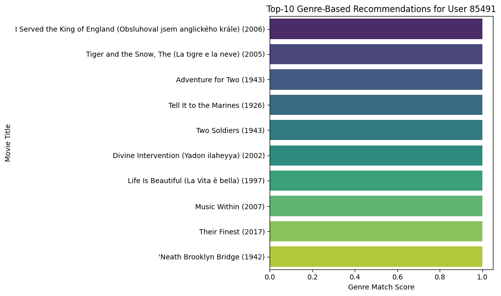

# **Laporan Proyek Machine Learning - Naufal Arsapradhana**

---

## Project Overview

Sistem rekomendasi film saat ini menjadi sangat penting di berbagai platform hiburan digital seperti Netflix, Disney+, dan Hulu untuk meningkatkan pengalaman pengguna dengan menyarankan film yang sesuai dengan preferensi mereka. Dalam proyek ini, dikembangkan sistem rekomendasi berbasis genre dan user-item collaborative filtering untuk memprediksi film yang mungkin disukai oleh pengguna berdasarkan riwayat dan kesamaan preferensi.

**Mengapa masalah ini penting untuk diselesaikan:**
Sistem rekomendasi dapat meningkatkan keterlibatan pengguna dan kepuasan layanan. Menurut \[Ricci et al., 2015], sistem rekomendasi memainkan peran kunci dalam membantu pengguna menavigasi pilihan yang sangat banyak dan menemukan item yang relevan.

**Referensi:**

* Ricci, F., Rokach, L., & Shapira, B. (2015). Recommender Systems Handbook. Springer.

---

## Business Understanding

### Problem Statements

1. Bagaimana cara merekomendasikan film yang relevan berdasarkan preferensi genre pengguna?
2. Bagaimana meningkatkan kualitas rekomendasi menggunakan pendekatan collaborative filtering?

### Goals

1. Menghasilkan top-N rekomendasi film berdasarkan genre yang pernah ditonton dan di-rating oleh pengguna.
2. Mengembangkan sistem berbasis user similarity (collaborative filtering) dan melakukan evaluasi terhadap hasil rekomendasi

### Solution Approach

**Solution Statement 1:** Menggunakan pendekatan content-based filtering dengan fokus pada genre film yang telah ditonton pengguna sebelumnya.

**Solution Statement 2:** Mengimplementasikan algoritma user-based collaborative filtering untuk mencari kesamaan antar pengguna berdasarkan rating film, lalu merekomendasikan film yang disukai pengguna serupa dengan menerapkan perhitungan Cosine Similarity dan metrik evaluasi Precision@K.

---

## Data Understanding

Dataset yang digunakan adalah [Movie Recommendation System](https://www.kaggle.com/datasets/parasharmanas/movie-recommendation-system), yang terdiri dari 250.000.000 rating dari 62.423 film.

**Jumlah data:**

* 200.000 baris rating setelah dilakukannya pengambilan sampel karena proses komputasi tidak dapat berjalan optimal dalam memproses lebih dari 250.000.000 baris
* 80.869 pengguna
* 62.423 film

**Kondisi data:** Data merupakan dataset bersih karena dataframe `movies_df` dan `ratings_df` tidak memiliki missing values maupun data duplikasi. Sehingga tidak perlu dilakukan proses data cleaning. Hanya saja data memiliki jumlah baris yang sangat banyak sehingga membuat proses komputasi tidak bisa berjalan secara optimal sehingga harus dilakukan pengambilan sampel pada beberapa baris.

**Fitur dalam dataset:**

* `userId` : ID pengguna
* `movieId` : ID film
* `rating` : nilai rating dari pengguna (0.5 sampai 5)
* `timestamp` : waktu rating diberikan
* `title` : judul film
* `genres` : genre film, dipisahkan dengan tanda '|'

**Langkah eksplorasi data (EDA):**

* **Analisis genre populer** untuk menganalisa genre dengan jumlah film terbanyak yang beredar di masyarakat. Analisa ini dapat sangat memudahkan perusahaan dalam merekomendasikan genre yang banyak dipasarkan.
* **Visualisasi distribusi rating** digunakan untuk menganalisa preferensi pengguna dalam memberikan rating sebuah film di mana didapatkan hasil analisa bahwa pengguna cenderung memberikan rating di atas 3.0.

---

## Data Preparation

**Langkah-langkah yang dilakukan:**

1. Menghapus entri dengan genre tidak tercantum `(no genres listed)`.
2. Menggabungkan file `ratings.csv` dan `movies.csv` berdasarkan `movieId`.
3. Membuat user-item matrix dari DataFrame df, di mana baris adalah userId, kolom adalah movieId, dan nilai adalah rating yang diberikan user terhadap film.
4. Membuat train-test split per pengguna agar dapat melakukan evaluasi rekomendasi dengan proporsi 80:20.
5. Membuat user-item matrix khusus dari data training, kemudian mengisi nilai yang kosong (NaN) dengan 0.
6. Mengubah string genre menjadi list menggunakan `.str.split('|')`.
7. Mengubah genre menjadi kolom biner (one-hot encoding).
8. Menggabungkan kembali kolom movieId dan title dengan vektor genre hasil one-hot encoding untuk membentuk movies_with_genres.

**Alasan tahapan tersebut:**

* Menghindari error dalam eksplorasi dan modeling
* Format genre yang terstruktur penting untuk filtering
* User-item matrix ilakukan agar matrix bisa digunakan dalam model seperti Collaborative Filtering berbasis matriks (misal cosine similarity atau matrix factorization).
* Evaluasi membutuhkan data uji yang tidak dilatih

---

## Modeling

**Model 1: Content-Based Filtering** adalah sistem rekomendasi yang berjalan dengan merekomendasikan item yang mirip dengan item yang disukai pengguna di masa lalu.

Langkah proses yang dilakukan:
* Membuat User-Item Matrix
* Menghitung Similarity Antar User menggunakan Cosine Similarity
* Cek apakah user ada dalam data training
* Ambil user-user yang mirip
* Hitung prediksi rating dengan weighted sum
* Hindari film yang sudah ditonton
* Ambil rekomendasi Top-N
* Ambil info judul dan genre dari movieId
* Mengurutkan kembali sesuai peringkat prediksi

**Model 2: User-Based Collaborative Filtering** adalah sistem rekomendasi dengan mencari pengguna dengan selera yang sama. Sistem ini bergantung pada pendapat komunitas pengguna.

Langkah proses yang dilakukan:
* Membuat Genre One-Hot Encoding
* Menghitung similarity antar film berdasarkan genre menggunakan Cosine Similarity
* Ambil film yang pernah dirating oleh user
* Ambil genre dari film yang ditonton user
* Ambil film yang belum pernah ditonton oleh user
* Hitung skor kemiripan genre
* Urutkan dan ambil Top-N rekomendasi

**Output:** Top-10 rekomendasi film per pengguna

**Kelebihan & Kekurangan:**

* **Content-Based Filtering:**

    ✅ Kelebihan
    1. Cepat dan Ringan Secara Komputasi

        - Rekomendasi dihitung berdasarkan fitur item (seperti genre film, deskripsi produk, atau kategori).
        - Tidak membutuhkan data dari user lain, cukup data item dan profil user yang bersangkutan.
        - Bisa langsung digunakan bahkan untuk user baru (cold-start) asalkan ada data preferensi awal.

    2. Dapat Dijelaskan (Explainable)

        - Bisa menjelaskan alasan suatu item direkomendasikan, misalnya: "Direkomendasikan karena Anda menyukai film bergenre Action dan Sci-Fi."
        - Cocok untuk sistem yang memerlukan transparansi atau justifikasi rekomendasi, misalnya dalam domain kesehatan atau pendidikan.

    3. Tidak Rentan terhadap Sparsity

        - Tidak bergantung pada banyaknya interaksi antar user, sehingga tetap bekerja baik meskipun data rating sedikit.

    ❌ Kelemahan
    1. Kurang Personalisasi
        - Hanya melihat karakteristik item yang disukai, bukan perilaku kolektif user lain.
        - Cenderung menghasilkan rekomendasi yang terlalu mirip dengan item sebelumnya (kurang eksplorasi).

    2. Terbatas pada Fitur Item
        - Jika metadata item terbatas atau tidak representatif, maka sistem sulit memberikan rekomendasi yang akurat.

* **Collaborative Filtering:**

    ✅ Kelebihan
    1. Lebih Akurat dan Personal

        - Berdasarkan kemiripan antar user (User-Based CF) atau kemiripan antar item (Item-Based CF) dari perilaku (rating, like, dll).
        - Mampu menangkap pola tersembunyi dari data historis, bahkan jika item tidak memiliki metadata yang lengkap.
        - Rekomendasi lebih bervariasi dan eksploratif, karena tidak terbatas pada fitur konten.

    2. Personalisasi Lebih Baik

        - Dapat merekomendasikan item yang tidak mirip secara konten, tapi disukai oleh user lain dengan pola preferensi serupa.

    ❌ Kelemahan
    1. Mahal Secara Komputasi
    
        - Membutuhkan perhitungan kemiripan antar user atau antar item, yang bisa sangat berat jika jumlah data besar.
        - Skala data besar memerlukan sistem komputasi yang efisien seperti matrix factorization, SVD, atau deep learning.

    2. Cold Start Problem

        - Tidak bisa bekerja optimal untuk:
        - User baru (tidak ada histori interaksi).
        - Item baru (belum pernah dirating oleh siapa pun).
        - Sistem tidak tahu preferensi atau relevansi karena tidak ada data historis.

    3. Rentan terhadap Sparsity
    
        - Jika banyak user hanya merating sedikit item, maka matriks interaksi menjadi sangat jarang (sparse) dan sulit menemukan kemiripan.
---

## Evaluation

**Metrik yang digunakan:** Precision\@K

Precision@K adalah metrik evaluasi yang mengukur berapa banyak item yang direkomendasikan dalam Top-K yang relevan (yaitu, benar-benar disukai atau dikonsumsi oleh pengguna di data aktual). Precision\@K mengukur berapa proporsi item yang direkomendasikan (K item teratas) benar-benar relevan (muncul di test set pengguna).

**Formula:**
$\text{Precision@K} = \frac{\text{Relevant items in top K}}{K}$

**Mengapa Precision@K digunakan di sistem rekomendasi?**
- Fokus pada Top-K hasil yang paling penting bagi pengguna.
- Berguna ketika kamu ingin tahu apakah sistem berhasil menaruh item yang benar-benar disukai pengguna di urutan teratas.
- Sederhana dan mudah dipahami.

**Langkah-langkah evaluasi:**
* Collaborative Filtering:
    - Ambil item relevan dari test set
    - Cek apakah user punya data test yang valid
    - Ambil daftar rekomendasi dari model
    - Hitung Precision@K dengan jumlah film relevan yang direkomendasikan dibagi total rekomendasi (k)
    - Tampilkan hasil evaluasi per user
    - Mengevaluasi beberapa user sekaligus dengan menghitung rata-rata Precision@K.
    - Memanggil fungsi evaluate_user_recommendation() untuk tiap user.
    - Memasukkan user yang memiliki data score valid.
    - Hitung dan tampilkan Average Precision.

* Content-Based Filtering:
    - Ambil film yang disukai user di test set. Skip user jika tidak ada data valid.
    - Ambil hasil rekomendasi genre-based dengan mengembalikan top-k rekomendasi.
    - Hitung Precision@K untuk mengukur seberapa banyak film yang direkomendasikan ternyata memang disukai user di test set.
    - Tampilkan hasil evaluasi.
    - Menjalankan fungsi evaluate_multiple_genre_users() untuk menghitung rata-rata Precision@K dari banyak user sekaligus.
    - Memanggil fungsi evaluate_genre_recommendation() untuk masing-masing user.
    - Hitung dan tampilkan rata-rata Precision

**Hasil evaluasi:**

* Collaborative Filtering: Precision\@10 = 0.1000

    | movieId | title                                              | genres                                 |
    |---------|----------------------------------------------------|----------------------------------------|
    | 524     | Rudy (1993)                                        | [Drama]                                |
    | 2263    | Seventh Sign, The (1988)                           | [Drama, Fantasy, Thriller]             |
    | 2010    | Metropolis (1927)                                  | [Drama, Sci-Fi]                        |
    | 2941    | South Pacific (1958)                               | [Musical, Romance, War]                |
    | 57669   | In Bruges (2008)                                   | [Comedy, Crime, Drama, Thriller]       |
    | 356     | Forrest Gump (1994)                                | [Comedy, Drama, Romance, War]          |
    | 4084    | Beverly Hills Cop II (1987)                        | [Action, Comedy, Crime, Thriller]      |
    | 1023    | Winnie the Pooh and the Blustery Day (1968)        | [Animation, Children, Musical]         |
    | 3307    | City Lights (1931)                                 | [Comedy, Drama, Romance]               |
    | 2425    | General, The (1998)                                | [Crime]                                |

* Content-Based Filtering: rata-rata Precision\@10 = 0.0000

    | movieId | title                                                 | genres                                 |
    |---------|-------------------------------------------------------|----------------------------------------|
    | 56060   | I Served the King of England (Obsluhoval jsem...)     | [Comedy, Drama, Romance, War]          |
    | 48032   | Tiger and the Snow, The (La tigre e la neve) (2005)   | [Comedy, Drama, Romance, War]          |
    | 101950  | Adventure for Two (1943)                              | [Comedy, Drama, Romance, War]          |
    | 60225   | Tell It to the Marines (1926)                         | [Comedy, Drama, Romance, War]          |
    | 188263  | Two Soldiers (1943)                                   | [Comedy, Drama, Romance, War]          |
    | 6017    | Divine Intervention (Yadon ilaheyya) (2002)           | [Comedy, Drama, Romance, War]          |
    | 2324    | Life Is Beautiful (La Vita è bella) (1997)            | [Comedy, Drama, Romance, War]          |
    | 60641   | Music Within (2007)                                   | [Comedy, Drama, Romance, War]          |
    | 169756  | Their Finest (2017)                                   | [Comedy, Drama, Romance, War]          |
    | 156469  | 'Neath Brooklyn Bridge (1942)                         | [Comedy, Drama, Romance, War]          |

Berikut beberapa alasan konkret mengapa skor Precision@K untuk kedua model sistem rekomendasi (collaborative filtering dan genre-based) dapat bernilai 0:

1. Ketidaksesuaian antara prediksi dan data test
    
    Model memberikan rekomendasi film yang tidak termasuk dalam daftar film yang diberi rating tinggi (≥ 3) oleh pengguna pada data test. Ini langsung menyebabkan perpotongan himpunan recommended_items dan actual_items bernilai kosong, sehingga precision = 0.

2. Preferensi pengguna tidak terwakili
    
    Model tidak berhasil menangkap preferensi aktual pengguna, entah karena keterbatasan data pelatihan atau karena pengguna memiliki selera unik yang tidak umum di antara pengguna lainnya.

3. Rekomendasi tidak relevan (Noise)
    
    Sistem memberikan film yang terlihat mirip secara genre atau pola rating, namun tidak relevan secara semantik atau personal terhadap minat pengguna sebenarnya, terutama pada genre-based model.

4. Cold-start parsial di test set
    
    Film-film yang disukai pengguna di test set mungkin tidak muncul atau kurang dikenal di data pelatihan, sehingga model tidak mampu merekomendasikannya kembali.

5. Dominasi item populer
    
    Model bisa saja terlalu banyak merekomendasikan film populer secara umum, tetapi bukan yang relevan bagi pengguna yang sedang dievaluasi.

6. Ukuran k terlalu kecil atau terlalu besar
    
    Jika nilai k (jumlah top rekomendasi) tidak seimbang dengan jumlah film relevan yang sebenarnya disukai oleh user, precision bisa rendah atau nol.
    
## Visualization

* **Collaborative Filtering**

    

    Fungsi `visualize_user_recommendations()` menghasilkan visualisasi bar chart dari 10 film rekomendasi teratas untuk seorang pengguna berdasarkan model user-based collaborative filtering. Pertama, fungsi menghitung skor prediksi rating dengan menjumlahkan skor kemiripan pengguna lain dikalikan dengan rating mereka terhadap setiap film, lalu dibagi total kemiripan untuk normalisasi. Film yang sudah ditonton pengguna dihindari dengan mengganti skornya menjadi negatif tak hingga. Setelah itu, fungsi mengambil 10 film dengan skor prediksi tertinggi dan menampilkan judul serta nilai prediksi dalam bentuk grafik batang horizontal, memudahkan analisis apakah urutan rekomendasi sesuai dengan skor prediksi yang dihasilkan. Dari visualisasi di atas, dapat diketahui bahwa rekomendasi film yang diberikan telah sesuai dengan urutan skor rekomendasi di mana film berjudul Rudy (1993) mendapatkan skor tertinggi di angka 0.1750, sedangkan film General, The (1998) menempati posisi sebagai film dengan skor rekomendasi paling rendah berada di rentang 0.0050 - 0.0075. 

* **Content-Based Filtering**

    

    Fungsi `visualize_genre_recommendations()` digunakan untuk memvisualisasikan hasil genre-based recommendation bagi seorang pengguna berdasarkan preferensi genre film yang telah mereka beri rating sebelumnya. Pertama, fungsi memanggil recommendation_by_genre untuk menghasilkan daftar rekomendasi film. Kemudian, genre dari film-film yang sudah diberi rating oleh pengguna diolah untuk menentukan genre yang paling sering muncul — diasumsikan sebagai genre favorit pengguna. Selanjutnya, setiap film rekomendasi diberi skor berdasarkan jumlah kecocokan antara genre film tersebut dan genre favorit pengguna. Visualisasi berupa bar chart horizontal menggambarkan genre match score dari setiap film rekomendasi, memperlihatkan urutan film dari yang paling tidak hingga paling sesuai dengan preferensi genre pengguna, sehingga memvalidasi bahwa sistem memberikan rekomendasi berdasarkan kemiripan genre.Dari visualisasi di atas, dapat diketahui bahwa setiap film yang direkomendasikan pada Top-N Recommendation memiliki rentang skor rekomendasi yang sama yaitu 1. Hal ini menunjukkan bahwa model dapat dengan akurat memberikan rekomendasi film sesuai dengan genre film yang disukai pengguna yaitu Comedy, Drama, Romance, War.

**Interpretasi:**
1. Sistem rekomendasi Content-Based Filtering berhasil mencapai goals untuk menghasilkan top-N rekomendasi dengan memberikan rekomendasi yang benar sesuai dengan kemiripan genre pada setiap film dengan film yang sebelumnya ditonton oleh pengguna.
2. Dengan mengimplementasikan algoritma User-Based Collaborative Filtering, kita mencari kesamaan antar pengguna berdasarkan rating film, lalu merekomendasikan film yang disukai pengguna serupa dengan menerapkan perhitungan Cosine Similarity dan metrik evaluasi Precision@K.
3. Collaborative filtering lebih menjanjikan untuk user-user dengan riwayat yang cukup, sementara genre-based cocok sebagai fallback untuk cold-start user.

---

**Catatan:**
Seluruh kode implementasi dilakukan menggunakan Python dan pustaka pandas, NumPy, dan scikit-learn.